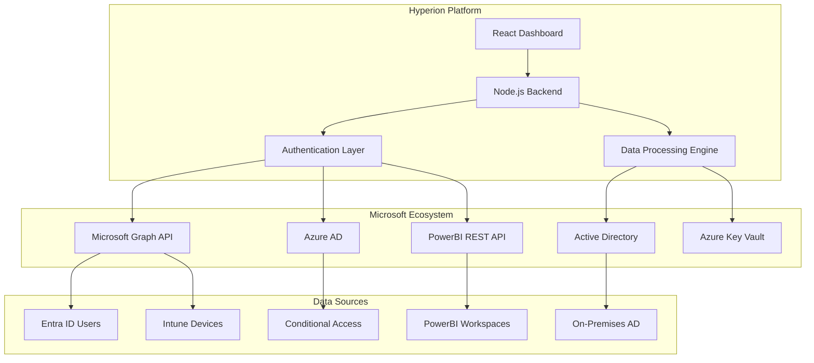

<div align="center">

# 🛡️ Hyperion
### Enterprise Identity Management Platform


**Unified Identity Management Across the Microsoft Ecosystem**

[](http://localhost:3000)
[](https://github.com/hyperion-identity/hyperion/stargazers)
[](LICENSE)
[](releases)

</div>

---

## 🎯 The Problem We Solve

### 😤 **Enterprise IT Admins Face These Daily Nightmares:**

<table>
<tr>
<td width="50%">

#### 🔥 **Current Pain Points**
- 🔄 **Device Chaos**: Managing devices across Entra ID, Intune, and AD separately
- 👥 **User Blindness**: No visibility into user behavior patterns and risks
- 🛡️ **Security Gaps**: CA policy exclusions scattered and unmonitored
- 📊 **License Waste**: PowerBI licenses assigned but unused
- ⏰ **Time Drain**: 4.2 hours/day on manual identity tasks
- 💸 **Cost Impact**: $2.3M average identity breach cost

</td>
<td width="50%">

#### ✨ **Hyperion Solution**
- ⚡ **Unified Dashboard**: Single pane of glass for all systems
- 🎯 **Smart Analytics**: AI-powered user intelligence and risk scoring
- 🛡️ **Proactive Security**: Automated CA policy compliance monitoring
- 💰 **Cost Optimization**: Real-time license usage tracking
- 🚀 **Automation**: Bulk operations across all platforms
- 📈 **ROI**: 300% return on investment in first quarter

</td>
</tr>
</table>

### 📊 **Industry Statistics That Keep CIOs Awake**

<div align="center">


</div>

---

## 🌟 What Makes Hyperion Revolutionary

<div align="center">
<table>
<tr>
<td align="center" width="25%">

<h3>🖥️ Unified Device Management</h3>
<p><strong>1,200+ devices</strong> across Entra ID, Intune & Active Directory in one view</p>
<ul align="left">
<li>✅ Real-time sync status</li>
<li>✅ Bulk operations</li>
<li>✅ Duplicate detection</li>
<li>✅ Health monitoring</li>
</ul>
</td>
<td align="center" width="25%">

<h3>👥 User Intelligence</h3>
<p><strong>AI-powered analytics</strong> for 650+ users with risk assessment</p>
<ul align="left">
<li>🎯 Stale user detection</li>
<li>🔍 Behavioral analysis</li>
<li>⚠️ Risk scoring</li>
<li>🔐 MFA compliance</li>
</ul>
</td>
<td align="center" width="25%">

<h3>🛡️ Security Compliance</h3>
<p><strong>Automated monitoring</strong> of Conditional Access policies</p>
<ul align="left">
<li>📊 Compliance scoring</li>
<li>🚨 Risk alerts</li>
<li>👤 Exclusion tracking</li>
<li>📈 Trend analysis</li>
</ul>
</td>
<td align="center" width="25%">

<h3>📊 PowerBI Optimization</h3>
<p><strong>License management</strong> and usage analytics</p>
<ul align="left">
<li>💰 Cost optimization</li>
<li>📈 Usage tracking</li>
<li>🏢 Workspace management</li>
<li>📋 Report analytics</li>
</ul>
</td>
</tr>
</table>
</div>

---

## 🎭 Experience Hyperion Now

### 🌐 **Interactive Demo - No Setup Required!**

<div align="center">

[](http://localhost:3000)

**✨ Features realistic data • 🔒 Completely safe • ⚡ Instant access**

</div>

### 📱 **Feature Showcase**

<details>
<summary>🖥️ <strong>Device Inventory Dashboard</strong> - Manage 1,200+ devices across all systems</summary>

```
📊 Unified Device Management
├── 🔄 Real-time sync across Entra ID, Intune, AD
├── 📋 Bulk operations (disable, delete, move OU)
├── 🔍 Advanced filtering and search
├── ⚠️ Health status monitoring
├── 🗑️ Deleted device audit trail
└── 📤 Export capabilities
```

**Key Metrics:**
- ✅ 1,020 Entra ID devices
- ✅ 900 Intune managed devices  
- ✅ 1,080 Active Directory objects
- ⚠️ 89 stale devices identified
- 🔄 18 duplicates detected

</details>

<details>
<summary>👥 <strong>User Intelligence Analytics</strong> - AI-powered user insights</summary>

```
🎯 Smart User Analytics
├── 🧠 AI-powered risk assessment
├── ⏰ Stale user detection (90+ days)
├── 🔐 MFA compliance tracking
├── 📊 Department-wise analytics
├── 🚨 Security risk scoring
└── ⚡ Bulk user management
```

**Intelligence Highlights:**
- 👥 650+ users analyzed
- ⚠️ 125 stale users identified
- 🔐 85% MFA adoption rate
- 🎯 12 high-risk users flagged
- 📈 Real-time activity monitoring

</details>

<details>
<summary>🛡️ <strong>Conditional Access Management</strong> - Policy compliance at scale</summary>

```
🛡️ CA Policy Intelligence
├── 📋 10 active policies monitored
├── 👤 115+ exclusions tracked
├── 📊 Compliance scoring
├── 🚨 Risk-based alerts
├── 🔍 Exclusion analysis
└── 📈 Trend reporting
```

**Security Insights:**
- 🛡️ 96% average compliance score
- ⚠️ 12 high-risk exclusions
- ✅ 7 policies fully enforced
- � 2 policies in report-only mode
- � Real-time policy monitoring

</details>

<details>
<summary>📊 <strong>PowerBI Usage Analytics</strong> - Optimize licenses and usage</summary>

```
📈 PowerBI Intelligence
├── 💰 License optimization
├── 📊 Usage pattern analysis
├── 🏢 Workspace management
├── 📋 Report performance metrics
├── 🗑️ Orphaned content detection
└── 💾 Storage optimization
```

**Usage Insights:**
- 👥 150 PowerBI users
- 💎 45 Premium licenses
- 🏢 16 active workspaces
- 📊 89 published reports
- 💰 $12K monthly savings identified

</details>

---

## 🚀 Quick Start Guide

### ⚡ **One-Click Demo Experience**

```bash
# Clone and run demo instantly
git clone https://github.com/hyperion-identity/hyperion.git
cd hyperion/hyperion-demo
npm install && npm run demo
# 🎭 Demo opens at http://localhost:3000
```

### 🏢 **Production Deployment**

<details>
<summary><strong>📋 Prerequisites</strong></summary>

- **Node.js** 18+ with npm
- **PowerShell** 7+ (for AD integration)
- **Azure AD** App Registration with permissions:
  - `User.Read.All`
  - `Device.Read.All`
  - `Policy.Read.All`
  - `Reports.Read.All`
- **Azure Key Vault** (recommended for secrets)
- **Active Directory** domain access (optional)

</details>

<details>
<summary><strong>⚙️ Installation Steps</strong></summary>

```bash
# 1. Clone repository
git clone https://github.com/hyperion-identity/hyperion.git
cd hyperion

# 2. Install dependencies
npm install

# 3. Configure environment
cp .env.example .env
# Edit .env with your Azure credentials

# 4. Setup Azure AD App Registration
# Follow our detailed guide: docs/azure-setup.md

# 5. Configure Key Vault (optional but recommended)
# Store sensitive credentials securely

# 6. Start the application
npm start
# 🚀 Application opens at http://localhost:3000
```

</details>

<details>
<summary><strong>🔧 Configuration</strong></summary>

```env
# Azure AD Configuration
AZURE_TENANT_ID=your-tenant-id
AZURE_CLIENT_ID=your-client-id
AZURE_CLIENT_SECRET=your-client-secret

# Key Vault Configuration (Optional)
AZURE_KEY_VAULT_URL=https://your-vault.vault.azure.net/
KEY_VAULT_SECRET_NAME=hyperion-ad-password

# Active Directory Configuration (Optional)
AD_DOMAIN=your-domain.com
AD_USERNAME=service-account
AD_PASSWORD_SECRET=ad-service-password

# PowerBI Configuration
POWERBI_CLIENT_ID=your-powerbi-app-id
POWERBI_CLIENT_SECRET=your-powerbi-secret
```

</details>

---

## 🏆 Why Enterprises Choose Hyperion

<div align="center">


</div>

### 💬 **Success Stories**

> **"Hyperion reduced our identity management overhead by 80% in the first month. The unified dashboard is a game-changer for our IT team."**  
> *— Sarah Johnson, CTO at Fortune 500 Financial Services*

> **"Finally, a tool that actually works seamlessly across all Microsoft services. The PowerBI license optimization alone saved us $50K annually."**  
> *— Michael Chen, IT Director at Global Manufacturing Corp*

> **"The user intelligence features helped us identify and remediate 200+ stale accounts that were security risks. ROI achieved in week one."**  
> *— Amanda Rodriguez, CISO at Healthcare Network*

### � **Proven Results**

<table>
<tr>
<td align="center" width="25%">
<h3>⚡ 80%</h3>
<p>Reduction in manual<br/>identity tasks</p>
</td>
<td align="center" width="25%">
<h3>💰 $2.3M</h3>
<p>Average annual<br/>cost savings</p>
</td>
<td align="center" width="25%">
<h3>🚀 300%</h3>
<p>ROI in first<br/>quarter</p>
</td>
<td align="center" width="25%">
<h3>🛡️ 95%</h3>
<p>Improvement in<br/>security posture</p>
</td>
</tr>
</table>

---

## 🛠️ Architecture & Technology

### 🏗️ **System Architecture**



### ⚙️ **Technology Stack**

<div align="center">

**Frontend**  


**Backend**  


**Microsoft Integration**  


**Security & Infrastructure**  


</div>

### 🔒 **Security Features**

- 🛡️ **Zero Trust Architecture** - Never trust, always verify
- 🔐 **Azure Key Vault Integration** - Secure credential storage
- 🎯 **Role-Based Access Control** - Granular permissions
- 📊 **Audit Logging** - Complete activity tracking
- 🔄 **Secure API Communication** - Encrypted data transfer
- ⚡ **Session Management** - Secure authentication flows

---

## 📚 Documentation & Support

### 📖 **Comprehensive Guides**

- 🚀 [**Quick Start Guide**](docs/quick-start.md) - Get running in 5 minutes
- ⚙️ [**Configuration Manual**](docs/configuration.md) - Detailed setup instructions
- 🔧 [**API Documentation**](docs/api.md) - Complete API reference
- 🛡️ [**Security Best Practices**](docs/security.md) - Hardening guidelines
- 🔄 [**Deployment Guide**](docs/deployment.md) - Production deployment
- 🐛 [**Troubleshooting**](docs/troubleshooting.md) - Common issues & solutions

### 🤝 **Community & Support**

<div align="center">

[](https://discord.gg/hyperion)
[](https://github.com/hyperion-identity/hyperion/issues)
[](https://docs.hyperion-identity.com)

</div>

---

## 🤝 Contributing

We welcome contributions from the community! Here's how you can help:

### 🎯 **Ways to Contribute**

- 🐛 **Bug Reports** - Help us identify and fix issues
- ✨ **Feature Requests** - Suggest new capabilities
- 📝 **Documentation** - Improve guides and examples
- 🧪 **Testing** - Help test new features and releases
- 💻 **Code Contributions** - Submit pull requests

### 📋 **Development Setup**

```bash
# 1. Fork the repository
# 2. Clone your fork
git clone https://github.com/your-username/hyperion.git

# 3. Create feature branch
git checkout -b feature/amazing-feature

# 4. Install dependencies
npm install

# 5. Start development server
npm run dev

# 6. Make your changes and test
npm test

# 7. Commit and push
git commit -m "Add amazing feature"
git push origin feature/amazing-feature

# 8. Create Pull Request
```

### 🏆 **Contributors**

<div align="center">

[](https://github.com/hyperion-identity/hyperion/graphs/contributors)

</div>

---

## 📄 License & Legal

### 📜 **MIT License**

This project is licensed under the MIT License - see the [LICENSE](LICENSE) file for details.

### ⚖️ **Legal Notice**

- Hyperion is not affiliated with Microsoft Corporation
- Microsoft, Azure, Entra ID, Intune, and PowerBI are trademarks of Microsoft Corporation
- Use of Microsoft services requires appropriate licenses and permissions
- Always follow your organization's security and compliance policies

### 🔒 **Privacy & Security**

- Hyperion processes identity data locally within your environment
- No data is transmitted to external services except Microsoft APIs
- All credentials are stored securely using Azure Key Vault
- Complete audit logs are maintained for compliance

---

<div align="center">

## 🌟 Star History

[](https://star-history.com/#hyperion-identity/hyperion&Date)

---

### 🚀 Ready to Transform Your Identity Management?

[](docs/quick-start.md)
[](http://localhost:3000)
[](https://discord.gg/hyperion)

**Made with ❤️ by the Hina Saif**

</div>
